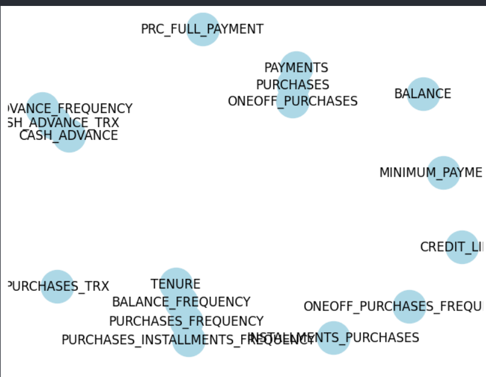
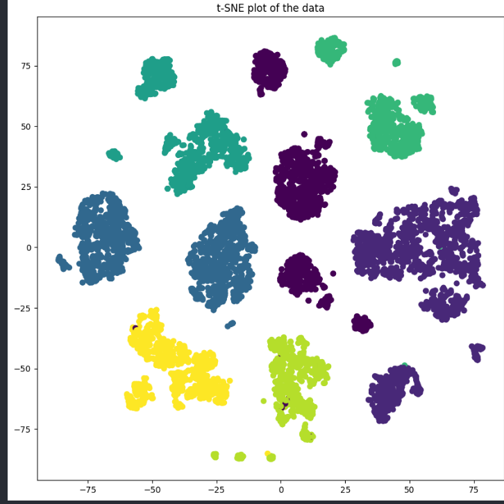
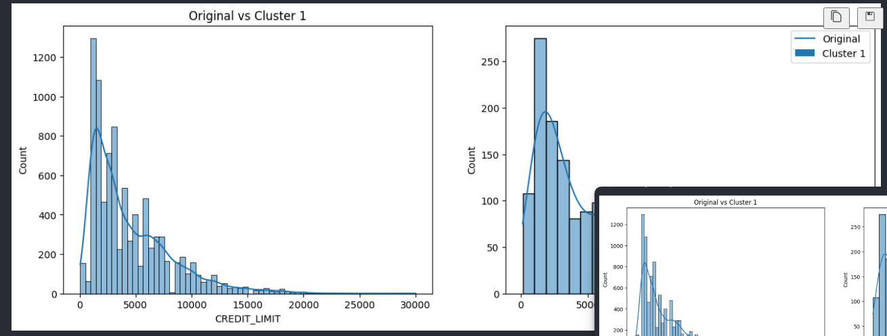

## Customer Segmentation based on Payment Behavior

This project explores customer segmentation using a credit card transaction dataset. The dataset contains various features related to customer credit card behavior (specific feature names are omitted here for brevity).

### Exploratory Data Analysis (EDA)

We perform EDA to understand the data's characteristics and identify patterns. This involves:

* **Univariate Analysis:** Examining the distribution of each feature (e.g., mean, median, standard deviation) to understand central tendencies and spread.
* **Bivariate Analysis:** Exploring relationships between pairs of features (e.g., scatter plots, correlation coefficients) to identify potential correlations and dependencies.
* **Multivariate Analysis:** Analyzing relationships between multiple features simultaneously to gain a more comprehensive understanding of the data structure.

This initial exploration helps identify potential issues like skewed data distributions, which can affect subsequent analyses.

### Data Preprocessing

Due to potential skewness in the data, transformations like log or square root are applied to normalize the feature distributions. Additionally, outliers might be addressed to ensure data quality and improve model performance.

After addressing these issues, we explore the relationships between features. Techniques like Principal Component Analysis (PCA) are used for dimensionality reduction when features exhibit high linear correlation. PCA identifies a smaller set of uncorrelated features that capture most of the data's variance, making clustering more efficient.

### Clustering

We apply various clustering algorithms to group customers based on their payment behavior. Here's a brief overview of the employed methods:

* **K-means Clustering:** A popular algorithm that partitions data points into a predefined number of clusters. 
* **Gaussian Discriminant Analysis (GDA):** A supervised technique that assumes Gaussian distributions within each cluster for improved separation.
* **Agglomerative Clustering:** A hierarchical approach that iteratively merges closest clusters until a desired number remains.
* **DBSCAN (Density-Based Spatial Clustering):** A density-based algorithm that identifies clusters based on areas of high density, effectively handling outliers.
* **Hierarchical Clustering:** Similar to agglomerative clustering, but builds a hierarchy of all possible merging steps, visualized as a dendrogram.

The process of determining the proper number of clusters was done individually on the Algorithms using different techniques like:
- The Elbow method to determine the proper K 
- The Silhouette score to determine the proper K

These algorithms provide different perspectives on customer segmentation.
 

 
### Cluster Visualization and Business Insights

We use t-SNE, a dimensionality reduction technique, to visualize the clusters in a lower-dimensional space for easier interpretation. By analyzing the characteristics of customers within each cluster, we gain valuable business insights.

These insights can help develop targeted marketing strategies, improve customer engagement, and potentially enhance sales and credit card usage. 

 
In this cluster all of them has tenure of 2 and they are purchasing frequently and using the application frequently
and they usally use it to buy multiple times not only one item as the one frequency average is 0.25